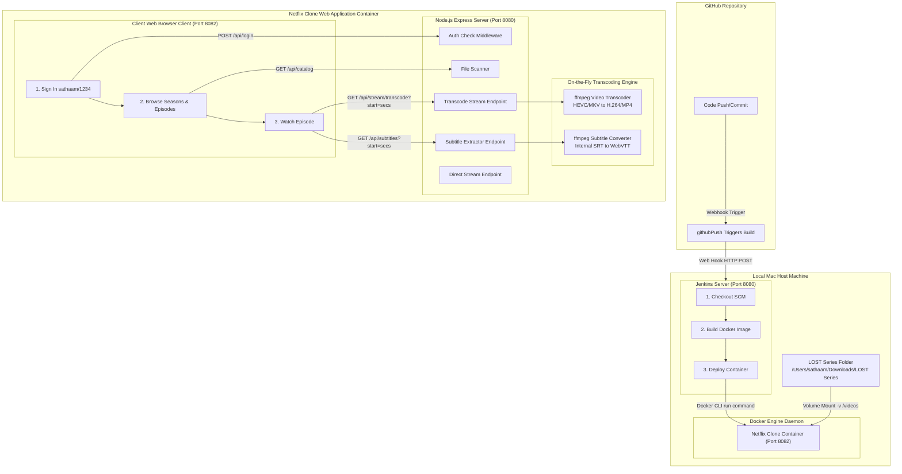

# Netflix Clone - LOST Series Streamer

A premium, localized Netflix-like web application designed to host and stream the television series **"LOST"** (6 seasons) from your local machine. The app features user authentication, a dark cinematic user interface, a custom media player with interactive seeking, on-the-fly HEVC to H.264 video transcoding, and automatic WebVTT subtitle extraction from internal MKV subtitle tracks.

The project is fully containerized and integrated with a **Jenkins CI/CD pipeline** to automate local Docker deployments whenever code changes are pushed to GitHub.

---

## 🏗️ System Architecture

The diagram below details the entire flow—from committing code on GitHub, triggering the Jenkins pipeline locally, building and deploying the Docker container with mapped storage volumes, to the inner streaming and transcoding mechanics of the Netflix Clone application:



---

## 🌟 Key Features

*   **🔒 Secure Local Authentication**: Hardcoded access credentials for user `sathaam` (password `1234`) using HTTP-Only cookies to protect API routes.
*   **📂 Dynamic Media Directory Scanner**: Scans mapped volumes dynamically on boot and indexes folders matching `Season [0-9]+` and filenames matching `SxxExx` or `Sxx-Exx`.
*   **🎬 Metadata Mapping**: Features a predefined lookup mapping for all **121 episodes** of the LOST series to display correct titles.
*   **🏎️ On-the-Fly HEVC Video Transcoding**: Automatically transcodes high-efficiency HEVC (x265) `.mkv` files into standard H.264 `.mp4` streams on-the-fly, allowing smooth video playback in any web browser without pre-converting files.
*   **💬 On-the-Fly Subtitle Extraction**: Automatically extracts the embedded English subtitle track from the `.mkv` container and converts it into browser-compliant WebVTT format on-the-fly.
*   **⏱️ Seek Synchronization**: Synchronizes both video and subtitle streams when scrubbing the progress timeline. Seeking triggers a request with `?start=seconds`, starting the transcoder and subtitle reader from the exact same frame.
*   **🎛️ Custom Netflix-like Media Player**: Complete with full-screen toggles, rewind/forward skip buffers (10s), scroll volume bars, auto-hiding overlay bars, and keyboard shortcuts (`Space` for play/pause, `F` for full screen, `Arrow Keys` for volume/seeking).

---

## 📁 Repository Structure

```text
.
├── Dockerfile              # Bundles Node.js, ffmpeg, and installs production modules
├── Jenkinsfile             # Orchestrates the local checkout, image compilation, and run steps
├── package.json             # Express server dependencies
├── server.js               # Node.js backend endpoints (auth, scanner, range-streams, transcoder)
├── .gitignore              # Ignores local node modules, DS_Store, and temporary logs
└── public/                 # Frontend SPA static client files
    ├── index.html          # HTML view wrappers (Login, Dashboard, Video Player)
    ├── style.css           # Premium Netflix-dark CSS layout and interface styles
    └── app.js              # State logic, API fetches, and custom HTML5 video controller script
```

---

## 🚀 How to Run Manually

If you want to run the container manually using the Docker CLI:

```bash
# 1. Build the Docker image
docker build -t netflix-clone-app:latest .

# 2. Run the container mapping ports and mounting your LOST folder
docker run -d \
  -p 8082:8080 \
  -v "/Users/sathaam/Downloads/LOST Series:/videos" \
  --name netflix-clone-container \
  netflix-clone-app:latest
```
Access the application at: **[http://localhost:8082](http://localhost:8082)**

---

## 🤖 Jenkins CI/CD Configuration

The `Jenkinsfile` utilizes the following parameters to automate local staging:
- **Port**: Maps host port `8082` to container port `8080` (preventing conflicts with Jenkins on `8080`).
- **Volume**: Maps host path `/Users/sathaam/Downloads/LOST Series` to `/videos` in the container.

### Step-by-Step Jenkins Setup:
1. Open Jenkins: **[http://localhost:8080](http://localhost:8080)**.
2. Select **New Item** -> Name it `netflix-clone-pipeline` -> Select **Pipeline** -> Click **OK**.
3. Under **Pipeline** section:
    *   Set **Definition** to: *Pipeline script from SCM*
    *   Set **SCM** to: *Git*
    *   Set **Repository URL** to: `https://github.com/Sathaam99/Netflix-clone-app.git`
    *   Set **Credentials** to: `MY_PAT`
    *   Set **Branches to build** to: `*/main`
    *   Set **Script Path** to: `Jenkinsfile`
4. Save the configuration.
5. In the left panel, click **Build Now** to trigger the build.
